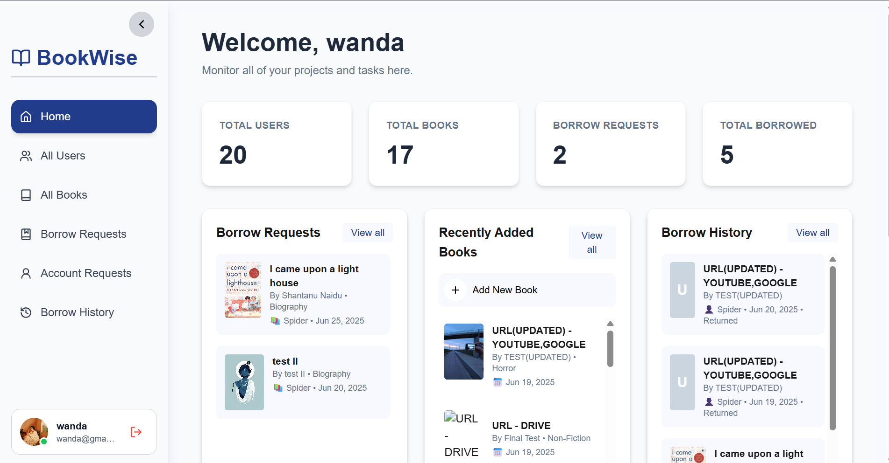
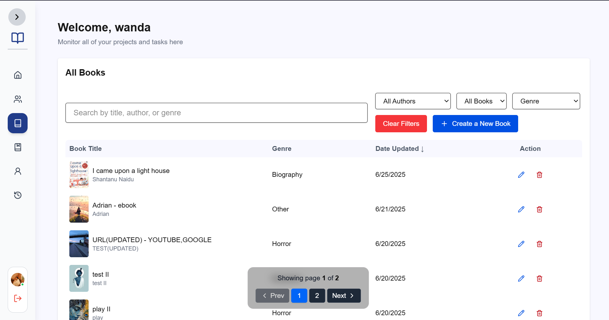
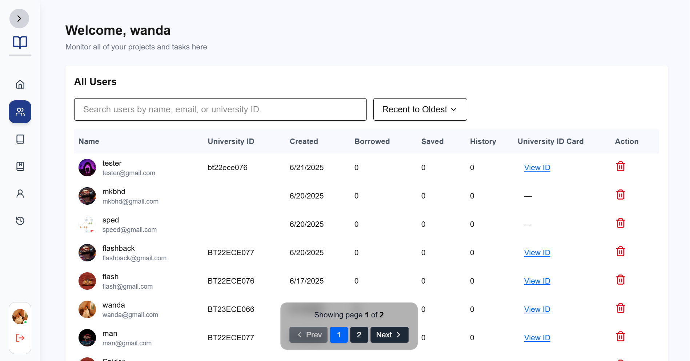
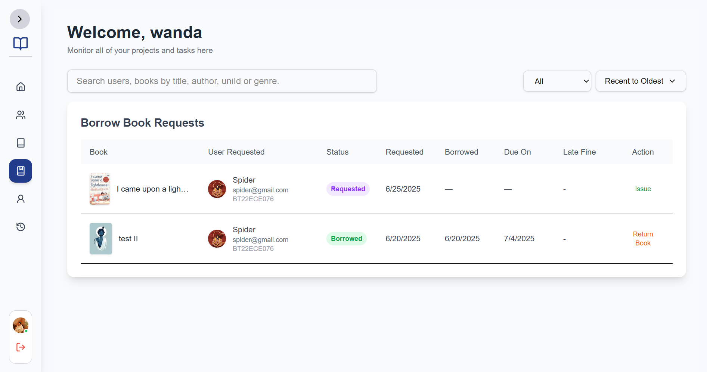
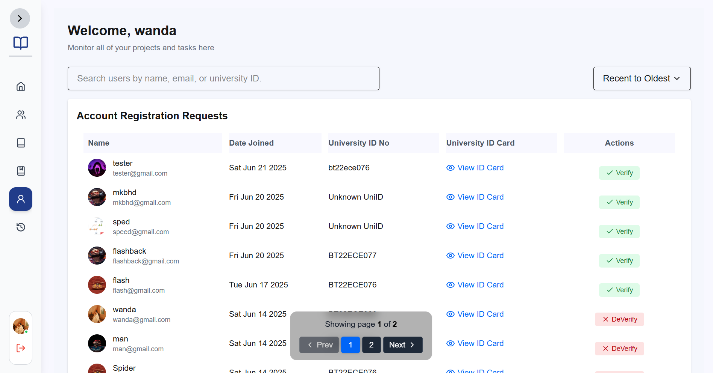
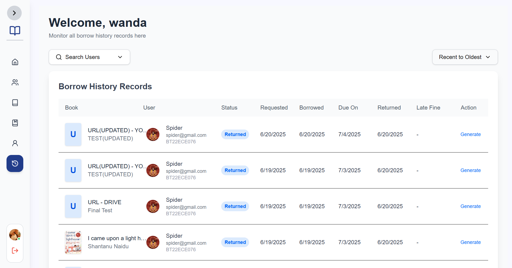
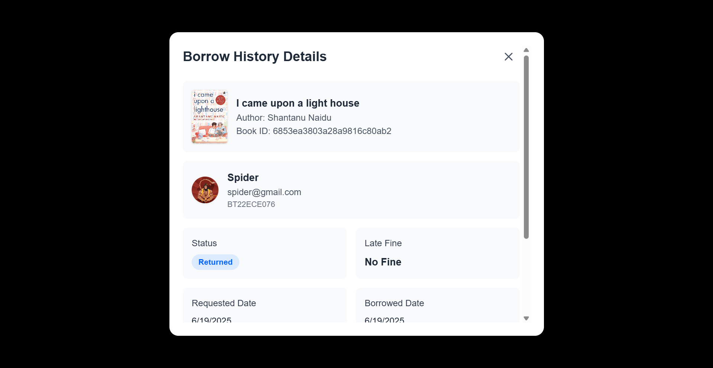
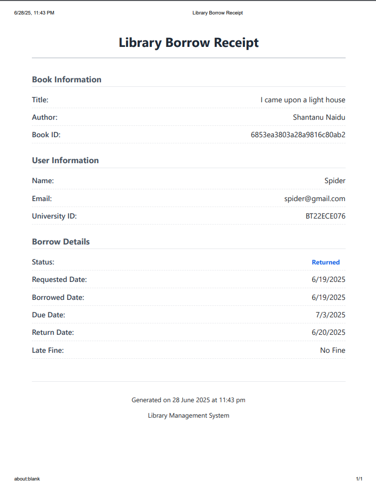

# 📚 BookWise Admin

**BookWise Admin** is the admin panel frontend for the BookWise library management system. Built with **React (Vite)** and **Tailwind CSS**, this interface allows library administrators to manage books, student borrow requests, user accounts, and more with an intuitive dashboard.

---

## 🚀 Live Demo

* **Frontend (Admin Panel)**: [bookwise-admin.vercel.app](https://bookwise-admin.vercel.app)
* **Frontend (Main Panel)**: [bookwise-main.vercel.app](https://bookwise-main.vercel.app)

---

## 🗃️ Github repo

* **Admin Panel**: [github.com/bhavyank89/bookWise-Admin](https://github.com/bhavyank89/bookWise-Admin)
* **Main Panel**: [github.com/bhavyank89/bookWise](https://github.com/bhavyank89/bookWise)

---

## ✨ Features

* 🔐 Admin Login & Signup
* 👩‍🎓 Student Registration & Verification
* 📚 Add, Edit, Delete, View Books (PDF/Video support)
* 📅 Borrow Requests & History
* 🔎 Live Search, Pagination & Sorting
* 📦 Download Books list as CSV or PDF
* 🎨 Smooth Animations with Framer Motion
* 🔔 Toast Notifications & Tooltips
* 🔒 Role-based Routing

---

## 🏗️ Tech Stack

* **React 19 + Vite**
* **TailwindCSS**
* **Framer Motion**
* **React Router v7**
* **Lottie React / dotLottie**
* **React Hot Toast & Sonner**
* **Lucide & Radix UI**

---

## 📂 Project Structure

```
📦 bookWise-Admin
├── frontend-dev/             # React + Vite frontend
│   ├── public/
│   ├── src/
│   │   ├── components/       # Reusable React components
│   │   ├── App.jsx
│   │   ├── App.css
│   │   ├── index.css
│   │   └── main.jsx
│   ├── index.html
│   └── vite.config.js
│
├── .gitignore
├── README.md
└── package.json
```

---

## ⚙️ Environment Variables

### Frontend `.env` (placed in `frontend-dev/`)

```env
VITE_SERVER_URL=http://localhost:4000
VITE_ADMIN_URL=http://localhost:3001
VITE_MAIN_URL=http://localhost:3000
```

---

## 🛠️ Local Development

### Step 1: Clone the Repository

```bash
git clone https://github.com/bhavyank89/bookWise-Admin.git
cd bookWise-Admin
```

### Step 2: Install Dependencies

```bash
cd frontend-dev
npm install
```

### Step 3: Run the Development Server

```bash
npm run dev
```

---

## 📦 Deployment

### Frontend on Vercel

* Import `frontend-dev/` folder from GitHub into [Vercel](https://vercel.com/)
* Set environment variables in the project settings
* Deploy 🚀

---

## 📸 Screenshots

#### Login/Signup Page


#### Dashboard



#### allbooks



#### allusers



#### book request



#### account request



#### borrow history



#### generate borrow receipt



#### print borrow receipt



---

## 🙌 Contributing

PRs are welcome! If you have suggestions or improvements, feel free to [open an issue](https://github.com/bhavyank89/bookWise-Admin/issues) or fork and contribute.

---

## 🧠 Author

Made with ❤️ by [Bhavyank Sarolia](https://github.com/bhavyank89)

---

## 📃 License

This project is licensed under the [MIT License](LICENSE).
